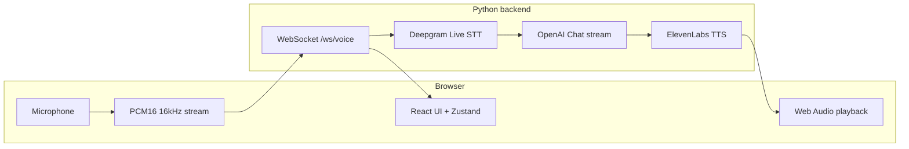

# Voxera

**Voxera** is a **local-first**, browser-based **realtime AI voice** demo: you speak, the system transcribes (Deepgram), reasons (OpenAI), synthesizes speech (ElevenLabs), and plays audio back while the UI shows **live transcripts**, **orb states**, and **measured pipeline latency**.

It is designed to clone, configure with API keys, and run **entirely on your machine** (or laptop + phone on the same Wi‑Fi) — no cloud hosting, Docker, or reverse proxy required for the default workflow.

---

## Architecture



| Layer | Responsibility |
|--------|----------------|
| **Frontend** (`voxera-frontend/`) | Mic capture, downsampling to 16 kHz mono PCM, WebSocket client, transcript + orb + metrics state, MP3 decode + playback. |
| **Backend** (`backend/`) | FastAPI + one WebSocket session per tab: forwards audio to Deepgram, runs OpenAI on final segments, calls ElevenLabs, streams JSON events + base64 MP3. |

---

## Tech stack

| Area | Choice |
|------|--------|
| UI | React 19, TanStack Start / Router, Tailwind, Framer Motion, Zustand |
| API | FastAPI, asyncio, `httpx`, `websockets` (client to Deepgram) |
| Runtime | Python 3.11+, Node 20+ (for Vite) |
| Voice AI | Deepgram (STT), OpenAI (chat completions stream), ElevenLabs (MP3 TTS) |

---

## Prerequisites

- **Python 3.11+**
- **Node.js 20+** (npm)
- Accounts / keys for **OpenAI**, **Deepgram**, and **ElevenLabs**

---

## Quick start (two terminals)

### 1) Backend — from repo root

```bash
cd backend
python -m venv .venv
# Windows PowerShell:
.\.venv\Scripts\Activate.ps1
# macOS / Linux:
# source .venv/bin/activate

pip install -r requirements.txt
cp .env.example .env
# Windows: copy .env.example .env
# Edit .env: set OPENAI_API_KEY, DEEPGRAM_API_KEY, ELEVENLABS_API_KEY (recommended)
python main.py
```

The API listens on **`http://0.0.0.0:8000`** (same as **`http://127.0.0.1:8000`** from the same machine).

Health check: open **`http://127.0.0.1:8000/health`** in the browser.

### 2) Frontend — from repo root

```bash
cd voxera-frontend
npm install
cp .env.example .env
# Windows: copy .env.example .env   (optional; dev defaults to http://127.0.0.1:8000)
npm run dev
```

The dev server runs on **`http://localhost:3000`** with **`--host`** so other devices on your LAN can open **`http://<your-LAN-IP>:3000`**.

---

## API keys (two supported modes)

### A) Keys in backend `.env` (recommended for a smooth demo)

In `backend/.env`:

```env
OPENAI_API_KEY=sk-...
DEEPGRAM_API_KEY=...
ELEVENLABS_API_KEY=...
```

The UI can call **`GET /api/voice-capabilities`**: when all three are set on the server, you can **Start** without pasting keys in the modal (keys in the UI are optional because the server merges env + client, with env winning when both exist).

Optional hard lock (no client override):

```env
VOXERA_DISALLOW_CLIENT_KEYS=true
```

### B) Keys only in the browser (API Configuration modal)

Leave the three env vars empty and paste keys in the app. They are stored in **localStorage** and sent over the WebSocket `init` message to **your** local backend only.

---

## WebSocket protocol (short)

- **Connect** to `ws://127.0.0.1:8000/ws/voice` (or `ws://<LAN-IP>:8000/ws/voice` from a phone).
- **Text `init`**: JSON with `aiSettings` and optional `keys` (see `backend/app/models/schemas.py`).
- **Binary frames**: little-endian **PCM16**, mono, **16000 Hz** (the frontend downsamples the mic).
- **Server → client JSON**: `ready`, `interim`, `orb`, `user_turn`, `assistant_turn` / `assistant_delta`, `metrics`, `audio` (MP3 base64), `error`, `pong`.

Client **ping** every ~25s keeps NATs and the stall watchdog happy; optional server idle close is controlled by `VOXERA_WS_IDLE_TIMEOUT_SECONDS` (default `0` = off).

---

## Latency metrics (real, server-side)

Each assistant turn ends with a `metrics` event:

| Field | Meaning |
|--------|---------|
| **stt** | ms from first interim of that utterance to Deepgram `is_final` for the segment |
| **llm** | Wall time for the OpenAI streaming completion |
| **tts** | ElevenLabs HTTP round-trip for MP3 |
| **total** | Wall time from pipeline start (after final transcript) through TTS bytes ready |

---

## Phone on the same Wi‑Fi (optional)

1. Note your laptop’s **LAN IP** (e.g. `192.168.1.10`).
2. In **`voxera-frontend/.env`**: `VITE_VOXERA_BACKEND_URL=http://192.168.1.10:8000`
3. Restart `npm run dev`.
4. On the phone, open **`http://192.168.1.10:3000`** (not `localhost`).

The backend already binds **`0.0.0.0`** via `python main.py`. Ensure your OS firewall allows inbound **8000** and **3000** on the private network.

---

## Troubleshooting

| Issue | What to check |
|--------|----------------|
| CORS errors | With default empty `VOXERA_CORS_ORIGINS`, the backend uses `*`. If you set a strict list, include your exact page origin (scheme + host + port). |
| WebSocket fails from phone | Same Wi‑Fi? Firewall? `VITE_VOXERA_BACKEND_URL` must use the **laptop IP**, not `127.0.0.1`, when the page is loaded from the phone. |
| “Disconnected” right after Start | Backend not running, wrong port, or init error — check browser devtools **Network → WS** and backend logs. |
| No audio playback | Tap **Start** once (user gesture) so the `AudioContext` can resume; iOS/Safari are strict about this. |
| Verify buttons fail | Backend must be up; `POST /api/verify/*` should return `{ ok: true }` when keys are valid. |

---

## Demo / screenshots

Record a short screen capture: orb states, interim transcript, assistant reply, and the pipeline metrics panel updating — that’s the intended “systems demo” loop. (Add your own GIF or images under `docs/` if you like; none are committed here to keep the repo lightweight.)

---

## Repository layout

```
backend/           FastAPI app (`app/`), local entrypoint `main.py`
voxera-frontend/   TanStack Start + React client
README.md          This file
```

---

## License / ethics

You are responsible for API usage and costs on your own keys. Do not commit real `.env` files to git.

---

**Summary:** `python main.py` + `npm run dev` → open **`http://localhost:3000`** → configure keys (or rely on `backend/.env`) → **Start** → speak. That is the entire local-first story.
